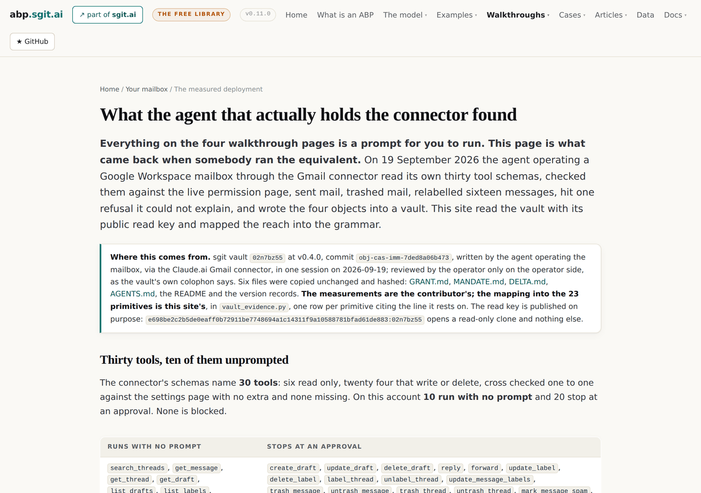
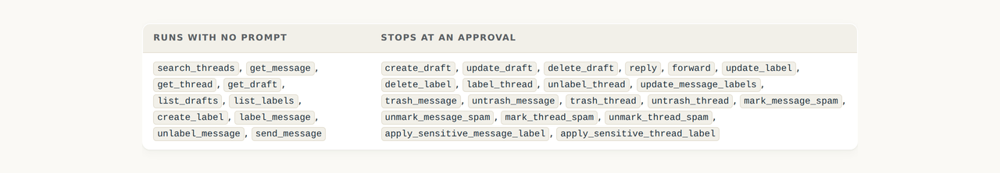
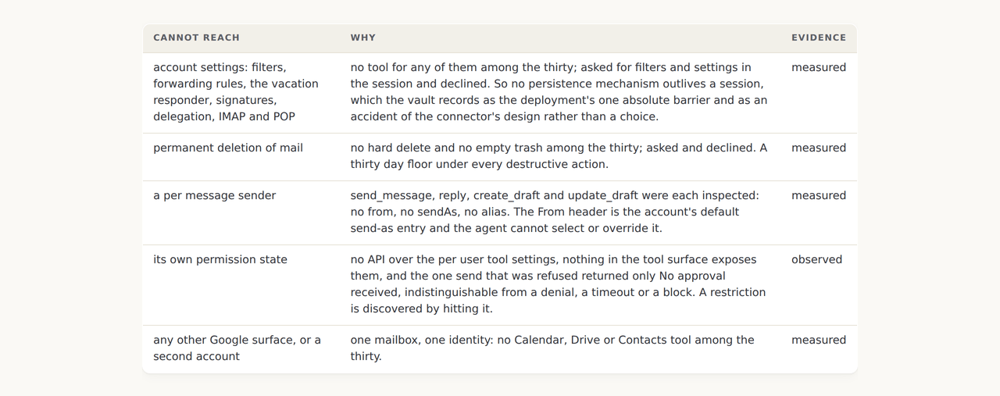
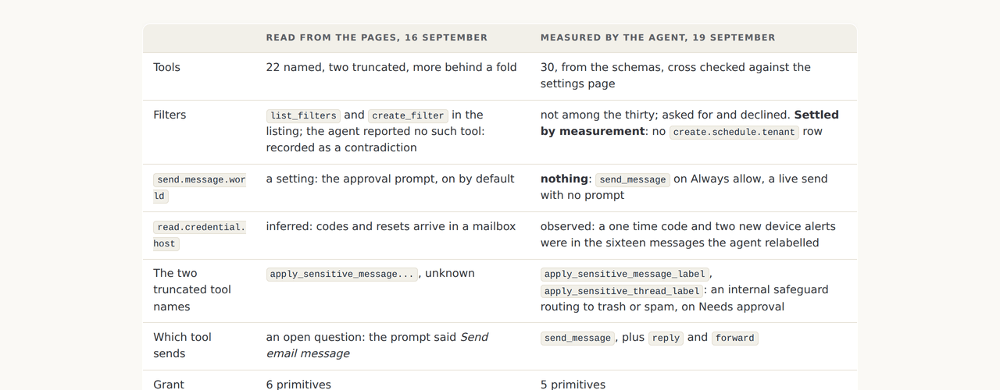
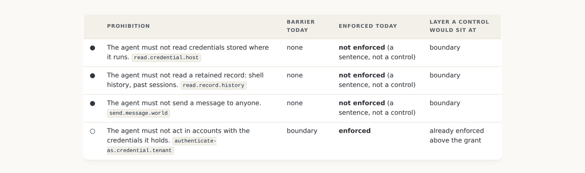
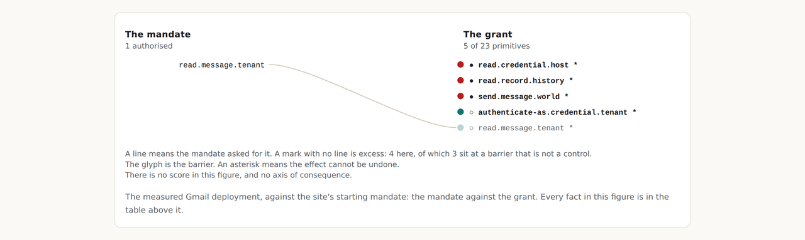

# v0.11.0: The Gmail connector measured end to end by the agent that holds it, and the ratchet as a number

> An agent read its own thirty tool schemas, sent mail with no prompt, hit a refusal it could not explain, and wrote the four objects into a vault in the connector's own words, naming the join to this grammar as a gap. This release is that join, and it puts the agent's inferred mandate beside the site's own so the gap between them is one row rather than a warning.

*Source: <https://abp.sgit.ai/articles/the-agent-that-holds-the-connector/index.html> · site v0.12.0 · this file is generated from the same content
as the page, so the two cannot drift. Every page on this site has a `.md` twin; internal links
below point at them.*

---

[Home](../../index.md) / [Articles](../../articles/index.md) / v0.11.0

# v0.11.0: The Gmail connector measured end to end by the agent that holds it, and the ratchet as a number

An agent read its own thirty tool schemas, sent mail with no prompt, hit a refusal it could not explain, and wrote the four objects into a vault in the connector's own words, naming the join to this grammar as a gap. This release is that join, and it puts the agent's inferred mandate beside the site's own so the gap between them is one row rather than a warning.

> **This is the article for release v0.11.0, published 22 September 2026.** Every release of this site gets one, and it explains what that release changed and why rather than restating [v0.11.0's own release record](../../versions/v0.11.0/index.md). It is release 15 of 15 on this site, and the most recent. Every screenshot below was captured from a checkout of the `v0.11.0` tag, so it shows the site as it stood at that release and not as it stands today. Nothing follows it yet, or back to [v0.10.0](../../articles/context-on-what-matters/index.md).

## The walkthrough asked a question, and a vault answered it

Every page of the mailbox walkthrough is a prompt for the reader to run against their own assistant, and the honest line under all of them was that this site had never seen the answer. On 19 September an agent operating a Google Workspace mailbox through the Gmail connector ran the equivalent: it read its own thirty tool schemas, checked them against the live permission page, sent mail, trashed mail, relabelled sixteen messages, hit one refusal it could not explain, and wrote GRANT.md, MANDATE.md, DELTA.md and AGENTS.md into an sgit vault. **It wrote them in the connector's own vocabulary and named the missing join to this grammar as a gap.** This release is the join.

*The page. The note under the lead names the vault, its version and commit, the six files copied unchanged, whose words are whose, and the read key, published on purpose because it opens a read-only clone and nothing else. (abp.sgit.ai at v0.11.0, captured 4 October 2026 from a checkout of the v0.11.0 tag.)*

## Thirty tools, and the one on the wrong side

The schemas name thirty tools, six read only and twenty four that write or delete, cross checked one to one against the settings page. On this account ten run with no prompt: every read tool, three label tools, and `send_message`. **Trashing a message needs approval and sending one does not**, which inverts the usual ordering, and the session confirmed the consequence by sending to an external address and finding that only the sender's copy could be trashed.

*The split as the settings page showed it. send_message is in the left column. The vault's whole recommendation is to move it to the right and leave create_draft open. (abp.sgit.ai at v0.11.0, captured 4 October 2026 from a checkout of the v0.11.0 tag.)*

> **The connector has no sender field.** Every compose tool was inspected: no from, no sendAs, no alias. The From header is the account's default send-as entry, which the operator set to a disclosed agent alias on a second domain. So the agent sends as the business and cannot send as anything else, and the disclosure is carried by the address before any signature has to.

## What the measurement changed, and what it did not replace

This site already held a profile for the shape, read from two vendors' pages and the directory listing on 16 September. The vault settles three of its open questions and one of its contradictions: which tool sends, what the two truncated tool names were, and whether filter tools exist. **They do not**, so the earlier profile's `create.schedule.tenant` row is absent from this one, and the grant got smaller by being measured. The earlier profile stays as a second variant of the same product, which is the pattern the site has used for a coding agent since v0.1.0.

*Read against measured. One barrier moved, from a setting to nothing, and the build derives the setting that distinguishes the two variants by diffing their grants. (abp.sgit.ai at v0.11.0, captured 4 October 2026 from a checkout of the v0.11.0 tag.)*

## The ratchet, as a number

MANDATE.md opens by saying it is not a mandate: the agent reconstructed it from ten things it was asked to do in one session and was not stopped from doing. DELTA.md then declines to compute a gap from it, with the clearest sentence in the vault: **an agent subtracting its own inferred mandate from its own measured reach will always report a narrow gap, because the act of using a capability is what put it in the mandate column.**

This site agreed and published the mechanism rather than the number alone. The measured grant is read against the site's own starting mandate and against the agent's inferred one, side by side, and the two deltas differ by exactly one primitive.

*Two mandates against one grant. The operator created an alias for the agent to send from and asked it to introduce itself to one person; the agent inferred that sending was authorised. The difference between the columns is that inference. (abp.sgit.ai at v0.11.0, captured 4 October 2026 from a checkout of the v0.11.0 tag.)*

*[A figure here in the page: on the left, what an approval prompt tells you, being the class of action, that something is about to happen, and a yes and a no. On the right, what it does not tell you: which message or thread, how many items, who the correspondent is, whether you can undo it, whether the label is one you built years ago, and whether this is one step of forty. So it appears to ask whether this action on this object is acceptable, and it actually asks whether you still want the thing you asked for thirty seconds ago, which has one answer. All six of the missing items are available to the software at the moment it asks]*

## HARD and SOFT are the four barriers under other names

AGENTS.md tags every rule the agent follows as HARD or SOFT, and its first section says what the file is: a soft barrier that shapes behaviour reliably under normal conditions, and not at all if it is absent from context, contradicted later, or overridden by content read from an untrusted source. **The tags map onto this site's barriers without remainder**, with one row the four have no home for: the operator reading each message as it is sent, which the vault says is the barrier doing the real work and which detects rather than prevents.

*The mapping. HARD by absence is a boundary; HARD by the settings page is a boundary for twenty tools; SOFT is an expectation; and a person reading along is not a barrier in the four, which is why nothing scheduled survives it. (abp.sgit.ai at v0.11.0, captured 4 October 2026 from a checkout of the v0.11.0 tag.)*

## What a measured row looks like beside a read one

Five primitives, five of five rows measured, two tiers: *observed* where the agent saw it on the thing itself in its own session, *measured* where the operator confirmed it from outside. The `read.credential.host` row is the one to notice: on the earlier profile it was inferred, because codes and resets arrive in mailboxes; here it is observed, because the sender based sweep that relabelled sixteen messages swept a one time code and two new device alerts along with the marketing it was aimed at.

*The grant against the site's mandate. Four marks with no line reaching them, three at a barrier that is not a control, and every row behind them seen on the thing itself. (abp.sgit.ai at v0.11.0, captured 4 October 2026 from a checkout of the v0.11.0 tag.)*

## What the gate learned

A vault is a contributor who wrote in their own vocabulary, so the manifest gained a `vaults` list beside `shapes`: the vault, its version and commit, the read key published on purpose, who wrote it, what was and was not copied, and the module that does the mapping. The gate accepts a vault entry's own retrieval time, counts vault shapes with the others, requires every named source to be among the hashed files, and **requires any read key a vault entry carries to be in the published list**, so a key on this site is published on purpose or not at all. One altered byte in the vault copy fails the build in two places, which was tested before the commit.

## What this release did not settle

- **The mandate is still inferred.** Fifteen questions in MANDATE.md wait for the business, and the load bearing one is whether the mandate covers unattended operation, because the control doing the real work is a person reading along.
- **`send_message` was still on Always allow when the vault was written.** The recommendation is one click and it had not been made.
- **The raw debrief and the runbook app stay in the vault**, cited by path, because the debrief carries a personal address. The four objects, the README and the version records were copied; two of them name a colleague by first name, which the editor has been asked about.
- **The container's reach is stated, not enumerated.** The same session held a shell, egress and two vault keys; the vault records it as reach beyond the mailbox, and this profile covers the connector alone.
- **One day, one account.** Connector tool sets change without notice; this is a snapshot with a date on it, and the next measurement is a third variant.

[The measured deployment](../../gmail/measured/index.md) &#183; [The verbatim bytes](../../data/contributed/riskmandate/manifest.json) &#183; [The walkthrough](../../gmail/index.md) &#183; [v0.11.0's own release record](../../versions/v0.11.0/index.md)

## Read the sequence

| Direction | The release |
|---|---|
| **Older** | [v0.10.0: The desktop walkthrough: on your own machine, host means your machine, and the mandate is a map of what matters before it is a list of rules](../../articles/context-on-what-matters/index.md) |
| **All of them** | [One article per release](../../articles/index.md) |

---

*[Site index for agents](../../llms.txt) · [HTML version](https://abp.sgit.ai/articles/the-agent-that-holds-the-connector/index.html)*
